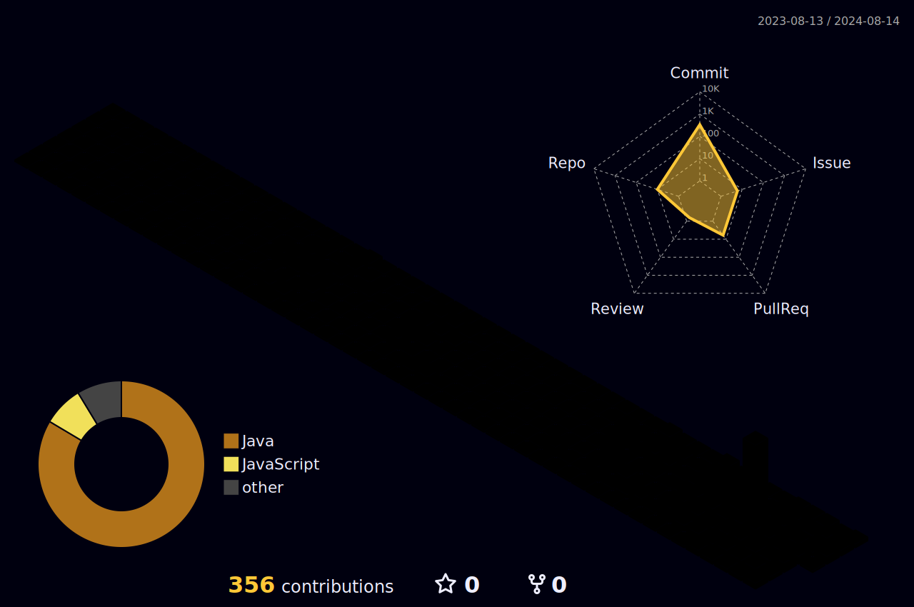

## Contact Me
 
If you want to contact me, and just [mail to me](mailto:shalpha_2@naver.com)

 

  

    
    

# myStack

    

        
<!--          -->
        
              
    

   

<!--          
          -->
         
       
        
         
    

    

         
         
              
<!--         -->
    

   

## TIL
> [!NOTE]
> 매일 개념과 코드 공부한 내용들 md 파일로 정리 합니다.

####  Docker [👆](https://github.com/keartt/TIL/tree/main/Tech%20Stack/Docker)

####  Git [👆](https://github.com/keartt/TIL/tree/main/Tech%20Stack/Git)

####  Java [👆](https://github.com/keartt/TIL/tree/main/Tech%20Stack/Java)

####  Linux & Server [👆](https://github.com/keartt/TIL/tree/main/Tech%20Stack/LInux%2BServer)

####  Nodejs  [👆](https://github.com/keartt/TIL/tree/main/Tech%20Stack/Node)

####  Postgresql [👆](https://github.com/keartt/TIL/tree/main/Tech%20Stack/Postgresql)

####  Spring [👆](https://github.com/keartt/TIL/tree/main/Tech%20Stack/Docker)

